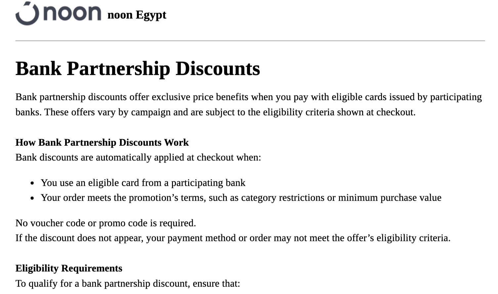
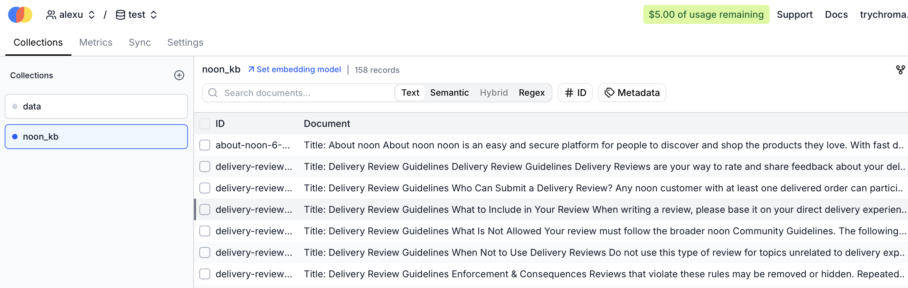
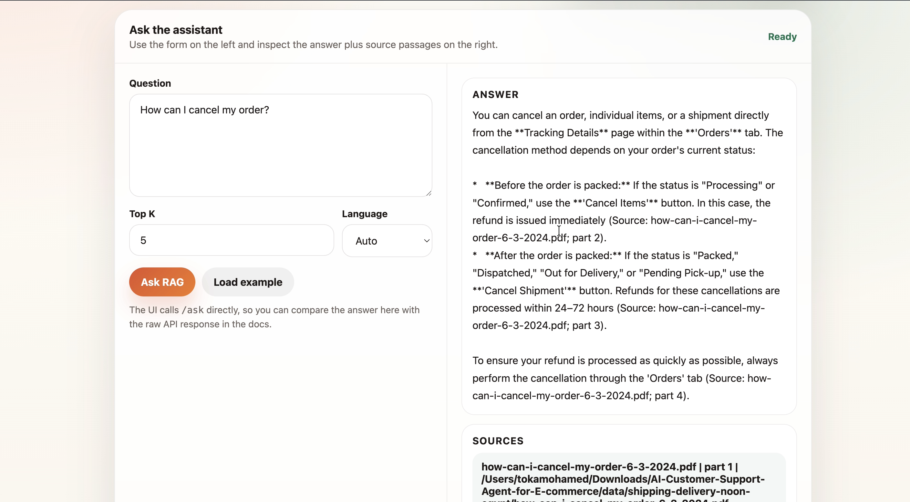
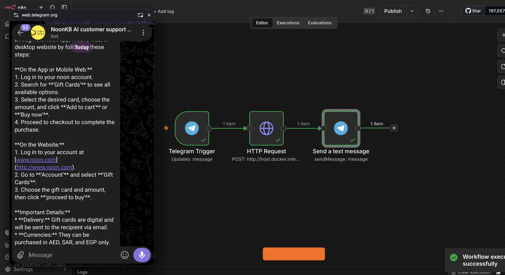

# AI-Customer-Support-Agent-for-E-commerce
 
A Retrieval-Augmented Generation (RAG) customer support assistant built on **noon Egypt's** public help center. The system scrapes the knowledge base, chunks and embeds the articles, stores them in a vector database, and answers customer questions (in English or Arabic) by retrieving relevant articles and generating a grounded response with Gemini.
 
A lightweight FastAPI test UI is included for local testing, and the pipeline is designed to be wired into a chat surface (e.g., Telegram, via n8n) for real customer-facing use.
 
---


## Table of Contents
 
- [Overview](#overview)
- [Architecture](#architecture)
- [Tech Stack](#tech-stack)
- [Pipeline Walkthrough](#pipeline-walkthrough)
  - [1. Data Collection (Scraping)](#1-data-collection-scraping)
  - [2. Chunking](#2-chunking)
  - [3. Embedding](#3-embedding)
  - [4. Vector Storage](#4-vector-storage)
  - [5. Retrieval & Generation (RAG Chain)](#5-retrieval--generation-rag-chain)
  - [6. Serving (FastAPI)](#6-serving-fastapi)
  - [7. Chat Deployment (Telegram via n8n)](#7-chat-deployment-telegram-via-n8n)
- [Project Structure](#project-structure)
- [Running the Project](#running-the-project)
- [Known Limitations](#known-limitations)
- [Roadmap](#roadmap)
---
## Overview
 
- **Domain:** E-commerce customer support (noon Egypt)
- **Data source:** [noon Egypt Help Center](https://helpegypt.noon.com/portal/en/kb) — ~64 public
  knowledge-base articles covering shipping, payments, refunds, gift cards, community guidelines,
  and account management. No sensitive or proprietary information is involved.
- **Goal:** Given a customer question, retrieve the most relevant help-center passages and generate
  a concise, accurate, policy-grounded answer instead of forcing the user to search the KB manually.
## Architecture
 
```
                ┌───────────────┐
                │  noon Help    │
                │  Center (web) │
                └───────┬───────┘
                        │ Playwright + Chromium
                        ▼
                ┌───────────────┐
                │  PDF articles │  (scraper/scrape.py)
                └───────┬───────┘
                        │ separator-aware chunking
                        ▼
                ┌───────────────┐
                │  chunks.json  │  (app/rag/chunking.py)
                └───────┬───────┘
                        │ EmbeddingGemma-300m (HF Inference API)
                        ▼
                ┌───────────────┐
                │  Chroma Cloud │  (app/rag/embeddings.py)
                │  (vector DB)  │
                └───────┬───────┘
                        │ LangChain retriever
                        ▼
                ┌───────────────┐        ┌─────────────┐
                │  RAG Chain    │───────▶│   Gemini    │
                │ (app/rag/     │        │  (answer    │
                │  chain.py)    │◀───────│ generation) │
                └───────┬───────┘        └─────────────┘
                        │
          ┌─────────────┴─────────────┐
          ▼                           ▼
   FastAPI + test UI          n8n → Telegram bot
   (app/api.py)                (production surface)
```
 
## Tech Stack
 
| Layer               | Tool                                                             |
|---------------------|-------------------------------------------------------------------|
| Scraping             | Playwright (Chromium), Python `urllib.parse` for URL/slug parsing |
| PDF parsing / chunking | PyMuPDF (`fitz`)                                                |
| Embeddings           | `google/embeddinggemma-300m` via Hugging Face Inference API       |
| Vector store         | Chroma Cloud                                                       |
| Orchestration        | LangChain (`langchain-core`, `langchain-chroma`, `langchain-google-genai`) |
| LLM (generation)     | Google Gemini 3-flash                                                     |
| API layer            | FastAPI + Uvicorn                                                   |
| Production chat surface | n8n workflow → Telegram Bot API                                 |
 
---
 
## Pipeline Walkthrough
### 1. Data Collection (Scraping)
 
`scraper/scrape.py` uses **Playwright with headless Chromium** (required because noon's help
center is a JS-rendered Zoho Desk portal — the "Download as PDF" button is a JS action, not a
static link) to:
 
1. Crawl the KB home page for category links.
2. Crawl each category for article links.
3. Visit every article and export it as a PDF, either by:
   - Clicking the native "Download as PDF" button and capturing the real download event, or
   - Falling back to `page.pdf()` with the print stylesheet emulated, if the button/download
     doesn't fire.
 
**Output:** ~64 articles saved as PDFs under `data/<category-slug>/<article-slug>.pdf`, listed in `data` with a folder for each category.


 
All content is public, non-sensitive help-center documentation (shipping, payments, refunds, gift
cards, community/review guidelines, account management) — no PII or confidential data.


### 2. Chunking

After collecting the articles, the dataset was split into **168 text chunks** for indexing in the vector database.

### Chunking Logic

Two chunking strategies were used depending on the document structure:

#### 1. Section-Based Chunking
Most of the documents are relatively short and organized into clear sections. For these documents, a **section-based chunking** approach was used, where each section becomes a single chunk. Since each section typically discusses a specific topic, this approach preserves semantic meaning and improves retrieval quality.

#### 2. Fixed-Size Chunking
Some documents were not divided into clear sections. For these documents, a **fixed-size chunking** strategy was applied to ensure that:
- No information was lost during chunking.
- Each chunk contained enough context for accurate retrieval.
- Adjacent chunks shared context through token overlap.

The following configuration was used:
- **Chunk size:** 150 tokens
- **Chunk overlap:** 20 tokens

**Output:** This process produced a total of **168 chunks**, which were stored in `chunks.json`.

Each chunk contains the extracted text along with metadata describing its source document and its position within that document. e.g.: 

```json
{
  "text": "Title: noon Pickup Points\n\nnoon Pickup Points\nnoon Pickup Points allow you to collect your order from one of noon’s partnered stores instead of receiving it at your home or office. This option appears at checkout when eligible for your order and location.",
  "metadata": {
    "source": "noon-pickup-point-faqs-6-3-2024.pdf",
    "path": "/Users/tokamohamed/Downloads/AI-Customer-Support-Agent-for-E-commerce/data/shipping-delivery-noon-egypt/noon-pickup-point-faqs-6-3-2024.pdf",
    "part": 1
  }
}
```

The metadata enables traceability by preserving the original document source and chunk order, allowing retrieved information to be mapped back to its origin during the RAG pipeline.


### 3. Embedding

Once the documents were chunked, each chunk was converted into a **dense numerical vector (embedding)** that captures its semantic meaning. These embeddings enable the retrieval system to find relevant information based on meaning rather than exact keyword matching.

For this project, the **`google/embeddinggemma-300m`** model was used through the **Hugging Face Inference API**.

##### Why EmbeddingGemma?

The model was selected because it:
- Produces high-quality semantic embeddings.
- Performs well for Retrieval-Augmented Generation (RAG) tasks.
- Is lightweight and can be accessed directly through the Hugging Face API without hosting the model locally.

##### Embedding Process

Each chunk generated in the previous step is sent to the embedding model. The model returns a high-dimensional vector representation of the chunk, while preserving its original metadata.

The resulting structure looks as follows:

```json
{
  "text": "Title: noon Pickup Points\n\nnoon Pickup Points allow you to collect your order from one of noon’s partnered stores instead of receiving it at your home or office...",
  "embedding": [
    0.0187,
    -0.0421,
    0.1379,
    -0.0084,
    "...",
    0.0542
  ],
  "metadata": {
    "source": "noon-pickup-point-faqs-6-3-2024.pdf",
    "path": "/Users/tokamohamed/Downloads/AI-Customer-Support-Agent-for-E-commerce/data/shipping-delivery-noon-egypt/noon-pickup-point-faqs-6-3-2024.pdf",
    "part": 1
  }
}
```

### 4. Vector Storage
 
`app/rag/embeddings.py` embeds every chunk and upserts it into a **Chroma Cloud** collection.
 

### 5. Retrieval & Generation (RAG Chain)
 
`app/rag/chain.py` wires everything together with LangChain:
 
1. The user's question is embedded and used to retrieve the top-*k* most similar chunks from Chroma (`RAG_TOP_K`, default 5).

2. Retrieved chunks are formatted with their source/part metadata (`app/rag/prompts.py`).

3. The question + formatted context are passed to Gemini through a system prompt that instructs the model to answer only from the supplied context, stay concise and professional, and say so explicitly if the answer isn't in the knowledge base rather than inventing policy.

### 6. Serving (FastAPI)
 
`app/api.py` exposes:
 
- `GET /` — a self-contained HTML/JS test UI for manually trying questions and inspecting sources.
- `GET|POST /ask` — the main RAG endpoint (`question`, optional `top_k`).
- `GET /health` — liveness check.

It also contains a simple web UI to test the RAG. 


### 7. Chat Deployment (Telegram via n8n)
 
For a real customer-facing surface, an **n8n workflow** wires the pipeline to Telegram:
 
1. **Trigger:** a Telegram message from a user.
2. **HTTP Request:** n8n POSTs the message text to the FastAPI `/ask` endpoint.
3. **Response:** the RAG answer is sent back to the user in the same Telegram chat.
This lets customers ask questions in natural language instead of manually searching the noon help
center.



---
 
## Project Structure
 
```
.
├── app/
│   ├── api.py                  # FastAPI app + test UI
│   ├── main.py                  # CLI entrypoint (delegates to run_cli)
│   └── rag/
│       ├── chain.py             # Retrieval + generation orchestration
│       ├── chunking.py          # PDF -> chunks.json
│       ├── config.py            # Env-driven configuration
│       ├── embeddings.py        # chunks.json -> Chroma Cloud
│       ├── llm.py               # Embedding + Gemini adapters
│       ├── prompts.py           # System prompt + context formatting
│       └── retrival.py          # Backward-compatible CLI shim
├── scraper/
│   └── scrape.py                 # Playwright scraper -> PDFs
├── chunks.json                    # Chunked KB articles (ingestion input)
├── app.py                         # Uvicorn launcher
├── Dockerfile                     # Serving image 
├── docker-compose.yml             
├── .dockerignore
├── requirements.txt                # Serving dependencies
└── README.md
```

## Running the Project
 
`chunks.json` already ships in the repo, so a fresh clone can go straight to embedding + serving

#### Docker
 
**1. Embed chunks and upsert into Chroma** (run once, and again whenever `chunks.json` changes):
```bash
docker compose run --rm rag-api python -m app.rag.embeddings
```
 
**2. Start the API:**
```bash
docker compose up --build
# then open http://localhost:8000
```
 
**3. Ask a question from the CLI, inside the running container:**
```bash
docker compose exec rag-api python -m app.main "How do I return an item?"
```

## Known Limitations
 
- **No conversation memory** — every question is answered independently; follow-up questions without full context will retrieve poorly.
- **No relevance threshold** — the retriever always returns `top_k` chunks even when nothing in the KB is actually relevant; the model relies solely on prompt instructions to say "not found."
- **No authentication or rate limiting** on the `/ask` endpoint — not safe to expose publicly as-is.
- **Chunk metadata currently includes local filesystem paths** from the original scraping machine —planned for removal (see Roadmap).
- The `path` field in chunk metadata is dev-machine-specific and not portable across environments.


## Roadmap
 
- [ ] Add multi-turn conversation support (condense chat history before retrieval).
- [ ] Add a similarity-score threshold / "no relevant context found" short-circuit.
- [ ] Strip local filesystem paths from chunk/embedding metadata.
- [ ] Add basic API-key auth and rate limiting to `/ask`.
- [ ] Add automated tests for chunking edge cases and the `/ask` endpoint.
- [ ] RAG evaluations 
 


